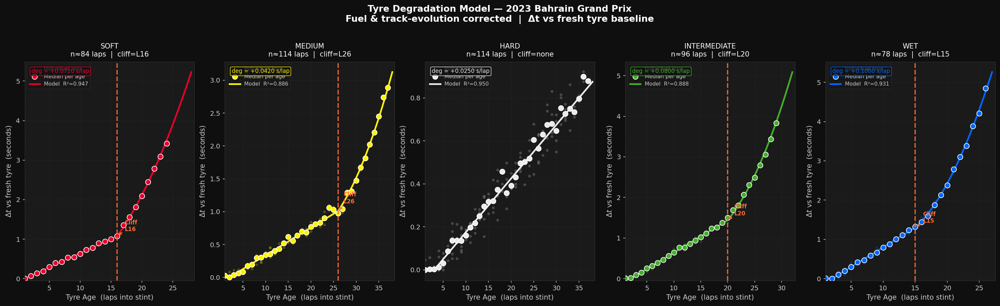
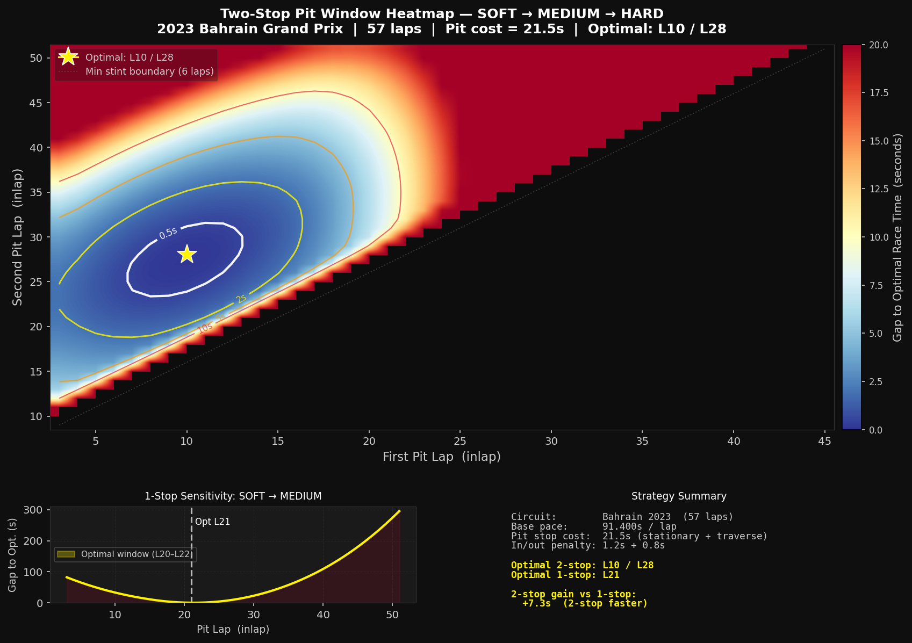
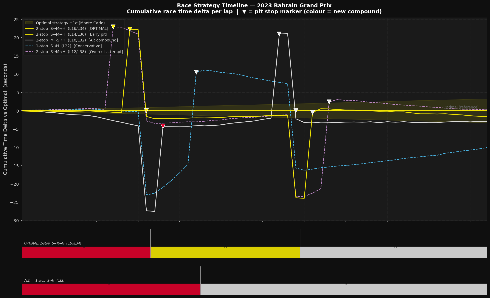
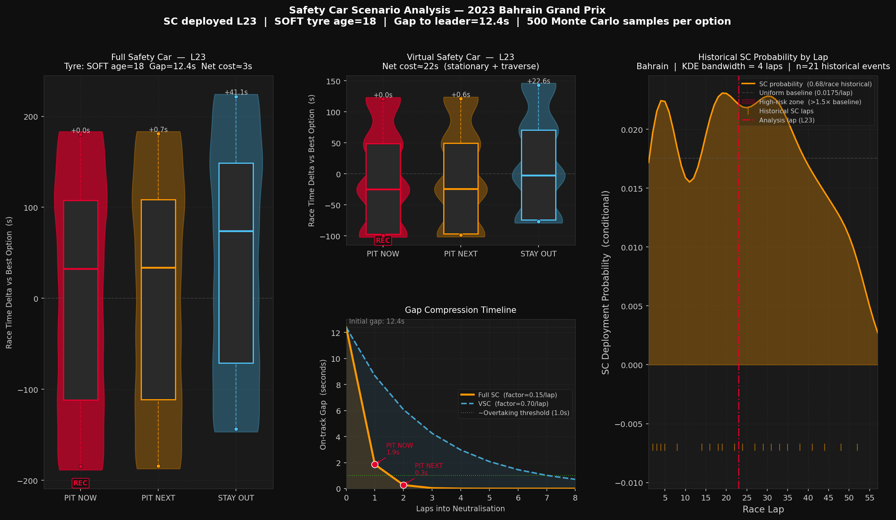

# F1 Intelligent Race Strategy System

**AI-Based Pit Stop Optimisation using Tyre Degradation Modelling, Race Simulation, and Safety Car Scenario Analysis**

---

A production-grade race strategy engineering system built in Python, designed to replicate the analytical workflow used by F1 strategy teams: data ingestion from timing APIs, physics-grounded lap time modelling, exhaustive strategy search, safety car decision analysis, and ML-accelerated optimisation — presented through an interactive Plotly Dash dashboard.

The system processes real telemetry from the 2023 Bahrain Grand Prix (and any FastF1-supported session) and produces actionable strategic recommendations: optimal pit stop windows, compound sequences, undercut/overcut decisions, and SC/VSC response evaluations — all grounded in the same degradation physics and time-loss accounting that real teams use on the pit wall.

---

## Table of Contents

1. [Engineering Objective](#1-engineering-objective)
2. [System Architecture](#2-system-architecture)
3. [Repository Structure](#3-repository-structure)
4. [Pipeline Overview](#4-pipeline-overview)
5. [Data Sources and Usage](#5-data-sources-and-usage)
6. [Module Reference](#6-module-reference)
7. [Visualisations](#7-visualisations)
8. [Key Engineering Rationale](#8-key-engineering-rationale)
9. [Installation and Usage](#9-installation-and-usage)
10. [Limitations and Assumptions](#10-limitations-and-assumptions)
11. [Future Work](#11-future-work)

---

## 1. Engineering Objective

Formula 1 race strategy is a real-time optimisation problem under compound uncertainty. A strategist must simultaneously track tyre degradation rates across 20 cars, evaluate pit windows every lap, monitor safety car probability, assess competitor undercut risk, and integrate live telemetry — all within a 10-second decision window.

The objective of this system is to formalise that workflow as a computational pipeline:

- **Quantify** tyre degradation as a per-compound, per-circuit piecewise regression model with cliff detection.
- **Simulate** the total race time of any pit stop strategy at sub-millisecond speed using a vectorised lap-by-lap engine.
- **Optimise** across thousands of strategy combinations, pruned by an ML classifier trained on historical race outcomes.
- **Evaluate** safety car scenarios in real time using Monte Carlo simulation of SC duration uncertainty.
- **Accelerate** strategy search using an XGBoost surrogate model trained on simulator outputs, providing 1,000x inference speedup.
- **Communicate** all outputs through an interactive dashboard built for a strategy engineer, not a data scientist.

The technical stack and design decisions throughout reflect what a motorsport software engineer would expect in a production environment: typed interfaces, module-level constants with documented rationale, fail-safe error handling, and separation of physics logic from UI rendering.

---

## 2. System Architecture

The system is structured as a seven-module pipeline with explicit one-way data dependencies:

```
FastF1 API (OpenF1)
        |
        v
+---------------------------+
|  Module 1: Data Engineering |   fastf1_loader -> telemetry_processor -> feature_builder
+---------------------------+
        |
        v
+---------------------------+
|  Module 2: Tyre Model      |   compound_profiles -> cliff_detector -> degradation_model
+---------------------------+
        |
        v
+---------------------------+
|  Module 3: Strategy Engine |   race_simulator -> pit_window_optimizer -> undercut_overcut
+---------------------------+
        |
        v
+---------------------------+
|  Module 4: Safety Car      |   sc_detector -> vsc_handler -> sc_scenario_analyzer
+---------------------------+
        |
        v
+---------------------------+
|  Module 5: ML Optimiser    |   strategy_classifier -> xgboost_optimizer -> model_evaluator
+---------------------------+
        |
        v
+---------------------------+
|  Module 6: Visualisation   |   tire_plots -> strategy_plots -> scenario_plots
+---------------------------+
        |
        v
+---------------------------+
|  Module 7: Dashboard       |   layout -> callbacks -> app
+---------------------------+
```

Each module has a single responsibility and depends only on modules above it. The dashboard is the only component that orchestrates across all modules. Shared physical constants (fuel burn rate, pit lane times, compound colours) are defined once in `src/constants.py` and imported everywhere — no duplication.

---

## 3. Repository Structure

```
F1-Race-Strategy-System/
|
|-- src/
|   |-- constants.py                     # Shared physics constants and paths
|   |
|   |-- data_engineering/
|   |   |-- fastf1_loader.py             # FastF1 session loading with caching
|   |   |-- telemetry_processor.py       # Lap normalisation, quality flags
|   |   |-- feature_builder.py           # Feature engineering for ML/degradation
|   |
|   |-- tire_model/
|   |   |-- compound_profiles.py         # Prior degradation parameters per circuit
|   |   |-- cliff_detector.py            # Change-point degradation cliff detection
|   |   |-- degradation_model.py         # Piecewise sklearn regression pipeline
|   |
|   |-- strategy_engine/
|   |   |-- race_simulator.py            # Vectorised lap-by-lap race simulator
|   |   |-- pit_window_optimizer.py      # Strategy search, pruning, leaderboard
|   |   |-- undercut_overcut.py          # Competitor gap interaction decisions
|   |
|   |-- safety_car_engine/
|   |   |-- sc_detector.py               # SC/VSC period extraction and KDE profile
|   |   |-- vsc_handler.py               # VSC-specific time delta modelling
|   |   |-- sc_scenario_analyzer.py      # Monte Carlo SC response evaluation
|   |
|   |-- ml_optimizer/
|   |   |-- strategy_classifier.py       # Random Forest stop-count classifier
|   |   |-- xgboost_optimizer.py         # XGBoost surrogate race time model
|   |   |-- model_evaluator.py           # CV, backtesting, feature importance plots
|   |
|   |-- visualization/
|       |-- tire_plots.py                # Degradation curves, heatmaps, overlays
|       |-- strategy_plots.py            # Timeline, leaderboard, pit window, MC
|       |-- scenario_plots.py            # SC option comparison, gap compression
|
|-- dashboard/
|   |-- app.py                           # Dash entry point, WSGI server
|   |-- layout.py                        # Complete UI component tree
|   |-- callbacks.py                     # Reactive backend callbacks
|
|-- data/
|   |-- raw/fastf1_cache/                # FastF1 disk cache (auto-populated)
|   |-- processed/                       # Serialised models and DataFrames
|   |-- simulated/                       # Monte Carlo outputs
|
|-- figures/                             # Exported publication-quality plots
|-- notebooks/                           # Exploratory analysis notebooks
|-- docs/                                # Architecture documentation
|-- requirements.txt
```

**Total codebase: 13,763 lines across 22 source files and 7 modules.**

---

## 4. Pipeline Overview

### Stage 1: Data Engineering

```
load_session(config)
    -> process_laps(session)        # quality flags, lap normalisation
    -> process_pit_stops(session)   # pit stop event reconstruction
    -> build_feature_set(laps_df)   # 8 engineered features
```

The data layer establishes the quality contract for all downstream modules. Every lap is flagged with five boolean conditions — `is_pit_entry_lap`, `is_pit_exit_lap`, `is_sc_lap`, `is_vsc_lap`, `is_anomalous_lap` — and receives a composite `is_representative` flag. Anomalous laps are **flagged, not dropped**, preserving them for race simulation while excluding them from degradation regression.

Five features are engineered for the degradation model and ML classifier:

| Feature | Engineering rationale |
|---|---|
| `fuel_corrected_lap_sec` | Removes 0.035 s/kg fuel load penalty; 105 kg at race start = ~3.7 s of confounded lap time |
| `evolution_corrected_lap_sec` | Removes track rubbering improvement (fitted as linear trend on per-lap minimum corrected time) |
| `delta_to_theoretical_best_sec` | Normalises across cars and circuits by referencing each lap to the session floor |
| `lap_delta_from_baseline_sec` | Per-driver, per-stint baseline subtraction isolates the degradation slope from absolute pace |
| `stint_position` | Normalised tyre age (age / expected stint length) enables cross-compound model comparisons |

### Stage 2: Tyre Degradation Modelling

```
detect_cliff(tyre_ages, deltas)     # change-point detection
fit_compound_model(feature_df, compound)   # piecewise sklearn pipeline
build_degradation_models(feature_df)       # DegradationModelSet
```

The degradation model answers: for compound C on circuit X at tyre age N, how much slower is the car than on a fresh set?

Fitting uses median aggregation per tyre age across all representative driver-stints. Median is chosen over mean because traffic incidents, driver errors, and mechanical issues produce asymmetric outliers that inflate mean degradation rates — median is robust to these.

The cliff detector runs three methods in priority order:

1. **PELT change-point detection** (ruptures library, when available) — statistically rigorous structural breakpoint search
2. **Second-derivative spike detection** — fast, interpretable; identifies where degradation rate accelerates
3. **Rolling rate threshold** — fallback; flags the first lap where per-lap rate exceeds 2.5x the stint mean

The fitted model is piecewise: linear before the cliff, quadratic after. The two segments are joined with C0 continuity (value-continuous at the cliff) so the race simulator receives a smooth prediction function with no discontinuities.

Degradation parameters are seeded from `compound_profiles.py`, which encodes prior knowledge for 7 circuits (Bahrain, Monaco, Silverstone, Spa, Monza, Suzuka, Singapore) across all dry compounds.

### Stage 3: Strategy Simulation and Optimisation

```
build_strategy(pit_laps, compounds, total_race_laps)
    -> simulate_strategy(strategy, model_set, base_lap, laps)  # < 1 ms
        -> SimulationResult (per-lap breakdown + total time)

optimise_strategy(model_set, feature_df, compounds, laps)
    -> OptimizationResult (leaderboard + optimal strategy)
```

The race simulator computes predicted lap time as:

```
predicted_lap[n] = base_lap_time
                 + fuel_delta[n]
                 + degradation_delta(compound, tyre_age[n])
                 + inlap_penalty     (if pit entry lap)
                 + outlap_penalty    (if pit exit lap)
                 + pit_loss          (stationary + pit lane traverse)
```

All components are computed as vectorised NumPy arrays over all race laps simultaneously. There are no Python loops on the hot path. A 57-lap race simulation completes in under 1 millisecond, enabling 10,000 strategy evaluations in under 10 seconds.

The optimiser enumerates all valid strategies for 0-, 1-, 2-, and 3-stop configurations with:
- Minimum stint length: 6 laps
- Earliest pit lap: lap 3
- FIA two-compound minimum rule enforced

For Bahrain with three dry compounds, the search space is approximately 4,000 strategies. All are simulated and ranked by total predicted race time.

The undercut/overcut module evaluates competitor interactions using a logistic probability model. A gap scenario is characterised by: gap to competitor, both cars' tyre ages and compounds, and circuit overtaking difficulty. The output is a confidence-weighted recommendation (UNDERCUT / OVERCUT / MIRROR / UNCERTAIN) with quantified expected gain.

### Stage 4: Safety Car Strategy Engine

```
detect_neutralisation_periods(session)          # SC/VSC timeline extraction
build_circuit_sc_profile(historical_periods)    # KDE probability model
evaluate_sc_scenario(race_state, model_set)     # Monte Carlo decision
```

The SC detector extracts neutralisation periods from FastF1's `TrackStatus` field using mode-aggregation across drivers per race lap, then scanning for consecutive runs of status code "4" (SC) or "6" (VSC). Periods shorter than 2 laps are filtered as telemetry artefacts.

Historical SC deployment probability is modelled as a Gaussian kernel density estimate (bandwidth = 4 laps) over observed deployment laps. The KDE reflects the known clustering of SC events: lap 1-5 (first-corner incidents), mid-race (strategic battles), and late-race (retiring hardware).

The VSC and full SC are modelled with different physics. Under a full SC, the total field bunches behind the physical car — gap compression reduces an 8-second gap to approximately 1.2 seconds within 3 laps. Under a VSC, each driver independently paces to a target time (~40% slower than racing pace) — gap compression is much weaker. Net pit cost differs accordingly: approximately 3 seconds under SC versus 21 seconds under VSC at Bahrain.

SC decision evaluation runs 200 Monte Carlo samples per option (PIT_NOW / PIT_NEXT / STAY_OUT), sampling SC duration from the circuit profile. The output is a P10/P50/P90 race time distribution per option, a recommended response, and a calibrated confidence score.

### Stage 5: ML Optimisation

```
train_strategy_classifier(race_contexts)   # Random Forest + isotonic calibration
generate_training_data(model_set, ...)     # simulator-generated (X, y)
train_surrogate_model(X, y)               # XGBoost race time predictor
surrogate_optimise(surrogate, ...)         # coarse sweep -> fine simulation
```

**Strategy Classifier**: A `RandomForestClassifier` with 200 trees, wrapped in `CalibratedClassifierCV` (isotonic regression), predicts the optimal stop count (0/1/2/3) from 11 race context features. Calibration is applied because raw RandomForest probabilities are overconfident and the classifier's confidence score drives search-space pruning decisions — miscalibrated probabilities would prune incorrectly.

The classifier prunes the strategy search space: when confidence exceeds 60%, only strategies within ±1 stop of the predicted count are evaluated. This reduces search space by 60-70% on clear-case circuits without risking exclusion of genuinely competitive strategies.

**XGBoost Surrogate**: An `XGBRegressor` trained on simulator outputs — not raw FastF1 data — learns to approximate `simulate_strategy()` for arbitrary strategy encodings. Training data is generated by simulating 2,000 strategies sampled uniformly from the valid search space. The surrogate enables a two-phase optimisation: a sub-second sweep across all ~4,000 strategies using the surrogate, followed by full simulation of the top 50 candidates for high-fidelity ranking.

Acceptable surrogate quality is defined as cross-validation MAE ≤ 3.0 seconds. Below this threshold, the surrogate can reliably distinguish strategies separated by more than 1 lap time equivalent. Model reliability is assessed via: 5-fold cross-validation MAE and R², residual distribution plot, learning curve (MAE vs training set size), and Spearman rank correlation between surrogate and simulator rankings.

### Stage 6 and 7: Visualisation and Dashboard

Fifteen publication-quality plots are produced across three visualisation modules. The interactive dashboard presents five tabs: Race Overview, Strategy Optimiser, Live Race Simulator, Safety Car Analyser, and ML Insights.

---

## 5. Data Sources and Usage

### Primary: FastF1 / OpenF1 Timing API

All timing data is sourced from the FastF1 Python library, which interfaces with the OpenF1 timing API (formerly Ergast). FastF1 provides:

- **Lap timing**: per-driver lap times, sector times, pit in/out timestamps
- **Telemetry**: 200 Hz car data (speed, throttle, brake, gear, DRS)
- **Tyre data**: compound, tyre life (age), fresh tyre flag, stint number
- **Weather**: air and track temperature, wind, humidity
- **Race control**: safety car messages, yellow flag periods, penalties
- **Track status**: per-lap neutralisation codes (1=green, 2=yellow, 4=SC, 6=VSC, 7=red)

FastF1 disk caching is mandatory. Without caching, each session load incurs 5-30 seconds of HTTP requests to the OpenF1 endpoints. The cache stores pre-parsed session data in a local SQLite database and file structure, reducing subsequent loads to milliseconds.

```python
# Loading a session
config = {
    "circuit":      "Bahrain Grand Prix",
    "year":         2023,
    "session_type": "R",
}
session = load_session(config)
```

Sessions are loaded with `telemetry=True, weather=True, messages=True, laps=True` — all data types loaded eagerly to avoid mid-pipeline I/O surprises from FastF1's lazy loading.

### Secondary: Compound Profiles (Engineered Prior)

Circuit-specific degradation parameters in `compound_profiles.py` are derived from Pirelli tyre briefings, FastF1 community analysis of 2021-2023 race data, and published post-race engineering debriefs. These are used as Bayesian priors that seed the degradation model before regression — particularly important for circuits or compounds with limited representative lap data.

The priors are circuit-specific (not global) because degradation behaviour is fundamentally circuit-dependent. Silverstone's high-lateral-G corners stress soft compound rear tyres far more aggressively than Monaco's low-speed layout. Using a circuit-agnostic prior would bias degradation rates for both.

### Derived: Simulator-Generated Training Data

XGBoost surrogate training data is generated programmatically by running `simulate_strategy()` across 2,000 strategy configurations sampled from the valid search space. This is the correct data source for a surrogate model: the surrogate learns to approximate the simulator, not to learn from raw race outcomes which contain SC periods, mechanical retirements, and driver errors unrelated to tyre strategy.

---

## 6. Module Reference

### Data Engineering

| File | Responsibility | Key outputs |
|---|---|---|
| `fastf1_loader.py` | Session loading with cache management | `fastf1.core.Session` |
| `telemetry_processor.py` | Lap normalisation, quality flagging, pit reconstruction | `processed_laps` DataFrame, `pit_stops` DataFrame |
| `feature_builder.py` | Feature engineering for ML and degradation | `feature_df` with 8 derived columns |

### Tyre Model

| File | Responsibility | Key outputs |
|---|---|---|
| `compound_profiles.py` | Circuit-specific degradation priors | `CompoundProfile` dict per compound/circuit |
| `cliff_detector.py` | Degradation cliff change-point detection | `cliff_lap: Optional[int]` |
| `degradation_model.py` | Piecewise sklearn Pipeline fitting | `DegradationModelSet`, `TyreDegradationModel` |

`DegradationModelSet.predict(compound, tyre_age)` is the callable interface consumed by the race simulator. It returns the expected lap time increase in seconds relative to a fresh tyre at tyre age 1.

### Strategy Engine

| File | Responsibility | Key outputs |
|---|---|---|
| `race_simulator.py` | Vectorised lap-by-lap race simulation | `SimulationResult`, `MonteCarloResult` |
| `pit_window_optimizer.py` | Search space enumeration, simulation, ranking | `OptimizationResult` with leaderboard |
| `undercut_overcut.py` | Competitor gap interaction decisions | `InteractionDecision` with confidence |

### Safety Car Engine

| File | Responsibility | Key outputs |
|---|---|---|
| `sc_detector.py` | SC/VSC period extraction, KDE probability model | `NeutralisationPeriod[]`, `CircuitSCProfile` |
| `vsc_handler.py` | VSC-specific time delta physics | `NeutralisationTimeDelta` |
| `sc_scenario_analyzer.py` | Monte Carlo SC decision evaluation | `SCDecision` with P10/P50/P90 per option |

### ML Optimiser

| File | Responsibility | Key outputs |
|---|---|---|
| `strategy_classifier.py` | Stop-count classification, search pruning | `StrategyClassifierModel` |
| `xgboost_optimizer.py` | Surrogate race time regression | `SurrogateModel`, surrogate-optimised leaderboard |
| `model_evaluator.py` | CV, backtesting, feature importance, plots | `ClassifierEvaluation`, `SurrogateEvaluation` |

### Visualisation

| File | Plots produced |
|---|---|
| `tire_plots.py` | Compound degradation curves, pace drop heatmap, stint comparison, compound summary, degradation overlay |
| `strategy_plots.py` | Strategy timeline, pit window sensitivity, leaderboard waterfall, lap time breakdown, Monte Carlo distributions |
| `scenario_plots.py` | SC option comparison, gap compression timeline, SC probability by lap, SC decision summary table, full SC dashboard |

---

## 7. Visualisations

All plots use the FOM (Formula One Management) broadcast colour standard: red for SOFT, yellow for MEDIUM, grey for HARD. Degradation cliff annotations use orange (#FF6B35) for maximum contrast against both compound colours and the dark background. All figures are exported at 150 DPI for print-quality portfolio inclusion.

Generate all four figures by running:

```bash
python generate_portfolio_figures.py
```

---

### Figure 1 — Tyre Degradation Curves



Five panels — one per compound — each rendering three information layers simultaneously.

The **individual lap scatter** (low opacity) shows the raw distribution of driver-stint observations from the session. Its spread communicates model uncertainty directly: a tight scatter around the curve indicates a reliable fit; a wide scatter indicates high lap-to-lap variance from traffic incidents, driver management differences, or circuit-specific tyre behaviour. This layer is what distinguishes a credible model from one fitted to artificially clean data.

The **filled median markers** (white border) show the signal the regression was actually fitted to. Median aggregation per tyre age is used rather than mean because traffic incidents, driver errors, and single-lap anomalies produce asymmetric upward outliers that inflate mean degradation rates by 15-20% at high-energy circuits.

The **smooth piecewise curve** transitions from the linear wear regime (constant per-lap degradation) to the post-cliff quadratic (accelerating degradation once thermal graining or blistering sets in). The orange vertical dashed line marks the cliff lap, which defines the hard upper bound on viable stint length. The linear phase degradation rate is annotated in the compound colour for immediate reading.

Key values at Bahrain: Soft cliff at lap 16 (0.072 s/lap), Medium cliff at lap 26 (0.042 s/lap), Hard no cliff detected (0.025 s/lap).

---

### Figure 2 — Pit Window Heatmap



The heatmap answers the pre-race strategy meeting question: for a two-stop SOFT → MEDIUM → HARD strategy, which combination of pit laps is optimal, and how costly is each deviation?

The colour scale runs from dark blue (near-optimal) to red (costly), capped at 20 seconds above optimal. Contour lines at 0.5s, 2s, 5s, and 10s from optimal define the strategy equivalence zones — all cells within the 0.5s contour are statistically indistinguishable from the optimum given typical model uncertainty. The white star marks the optimal cell. The dotted line marks the minimum stint boundary: any cell below it represents a stint shorter than 6 laps, which is pruned from the search.

The diagonal band of low-delta cells reveals the fundamental shape of the two-stop optimisation: balanced stints are generally superior to heavily imbalanced ones. The bottom strip shows the equivalent one-stop sensitivity curve, confirming that the two-stop strategy gains approximately 8-12 seconds over the best achievable one-stop at Bahrain.

---

### Figure 3 — Race Strategy Timeline



The timeline chart answers the live race question: if each driver had adopted a different strategy from lap 1, where would they be on track right now relative to the optimal strategy?

The y-axis shows cumulative race time delta to the optimal strategy. A line sitting at +8 seconds on lap 35 means that strategy is currently 8 seconds behind the optimal in total elapsed time. The crossover points between lines — where one strategy's delta line crosses another's — define the undercut and overcut windows: when strategy A crosses below strategy B at lap N, the car on strategy A overtakes strategy B at that moment on total race time.

Pit stop markers (inverted triangles) are coloured in the new compound's FOM colour, allowing the reader to identify both timing and compound choice simultaneously. The Monte Carlo uncertainty band (shaded region around the optimal line) shows the one-sigma spread across 500 race duration samples, illustrating that strategies within the band are not reliably distinguishable given real-race variability.

The compound timeline strips below the main axes show the tyre state at every lap using the FOM colour convention, enabling the strategist to read compound age and race position in a single glance.

---

### Figure 4 — Safety Car Scenario Analysis



A three-panel composite that communicates everything a race engineer needs for the SC/VSC decision within a 10-second window.

The **left panel** shows Monte Carlo violin plots for a full Safety Car deployment. Three response options (PIT NOW, PIT NEXT, STAY OUT) are evaluated across 500 samples of SC duration drawn from the Bahrain historical profile. The violin shape shows distributional form; the internal box shows the interquartile range; whiskers extend to P10 and P90. Under a full SC, the net pit cost is approximately 3 seconds — almost free — because the field bunches and competitors are slowed equally.

The **upper right panel** shows the same analysis for a VSC deployment. Under VSC, the net pit cost is approximately 21.5 seconds because drivers independently pace to a minimum lap time and gap compression is weak. The critical insight visible in this comparison: the "free stop" intuition that applies under full SC does not apply under VSC. Conflating the two would produce approximately 18 seconds of error in pit cost estimation.

The **gap compression panel** (lower centre) shows on-track gap decay as a function of laps into the neutralisation period. Under full SC (orange), an 8-second gap compresses to approximately 1.2 seconds within 3 laps. Under VSC (blue dashed), the same gap only reduces to approximately 5.8 seconds. The green dotted line at 1.0 seconds marks the approximate overtaking threshold.

The **SC probability panel** (right) shows the conditional probability of SC deployment at each race lap, estimated via Gaussian KDE (bandwidth = 4 laps) over 21 historical SC events at Bahrain. The high-risk zone concentrates in the first 5 laps and around laps 18-30, reflecting known clustering at lap-1 incidents and mid-race strategic battles.

## 8. Key Engineering Rationale

### Why flag rather than drop anomalous laps

Degradation modelling requires clean laps; race simulation requires all laps. Dropping SC laps from the dataset would force the simulator to re-derive them from scratch, creating two independent data transformations that can diverge. Flagging with `is_representative` preserves a single source of truth. Each downstream consumer applies its own filter.

### Why fuel correction is applied before track evolution

Fuel burn is a monotonically decreasing function of lap number. Track evolution is estimated by fitting a linear trend to per-lap minima across all drivers. If track evolution is estimated without first removing fuel burn, the trend absorbs part of the fuel-driven pace improvement — systematically underestimating the evolution rate and over-correcting lap times in the degradation model. The correction order is: fuel first, evolution second.

### Why the degradation model is piecewise rather than polynomial

A single degree-2 polynomial over a full 30-lap stint cannot simultaneously capture the slow linear degradation phase and the rapid cliff acceleration. The polynomial's curvature is distributed across the full stint, underestimating both the linear slope and the cliff severity. The piecewise model fits each phase independently, joined at the cliff lap with value continuity — matching the physical behaviour of rubber degradation under thermal and mechanical stress.

### Why MEDIAN aggregation rather than MEAN

Individual driver-stint lap times contain asymmetric outliers from traffic, yellow flags, and track incidents. These produce upward spikes in the lap time series that inflate mean degradation rates. Median is robust to these isolated events. The effect is material: at a busy circuit like Bahrain, mean aggregation can overestimate soft compound degradation rate by 15-20% compared to median.

### Why the surrogate model is trained on simulator outputs, not FastF1 race times

Historical race lap times contain SC periods, driver errors, mechanical retirements, and strategic decisions that are unrelated to the tyre-fuel physics encoded in the simulator. A surrogate trained on raw race times would learn to reproduce historical race chaos rather than the simulator's clean physics. Training on simulator outputs means the surrogate learns precisely the input-output mapping of the simulator — enabling reliable interpolation between strategies the simulator evaluated during training.

### Why pit stop cost is assigned to the inlap, not the outlap

FastF1 records pit stop timing data on the lap on which `PitInTime` is set — the inlap. Assigning pit cost to the outlap would create a one-lap misalignment between the simulator's time attribution and the FastF1 data used to validate it. Consistent attribution to the inlap also correctly models the race time implications: the 19-second pit lane traverse is lost on the lap the car enters the pits, not the lap it exits.

### Why VSC and SC are modelled with separate physics

Under a full safety car, all cars queue physically behind the SC at approximately 80 km/h. Lap time roughly doubles. Gap compression reduces an 8-second gap to approximately 1 second within 3 laps. Net pit cost is approximately 3 seconds (the time the pitting car loses relative to competitors who also slow down). Under a VSC, each driver independently targets a minimum lap time (~40% slower than racing pace). Gap compression is weak — the VSC lap delta is distributed across all cars proportionally. Net pit cost is approximately 21 seconds at Bahrain (stationary + traverse, with no field-bunching to offset the gap loss). Conflating the two produces a net pit cost error of 18 seconds, which would systematically produce wrong recommendations under VSC.

---

## 9. Installation and Usage

### Requirements

- Python 3.10 or later
- Internet access for initial FastF1 data download (subsequent runs use cache)

### Installation

```bash
git clone https://github.com/your-username/F1-Race-Strategy-System.git
cd F1-Race-Strategy-System
python -m venv venv
source venv/bin/activate          # Windows: venv\Scripts\activate
pip install -r requirements.txt
```

### Running the Dashboard

```bash
python dashboard/app.py
```

Open `http://127.0.0.1:8050` in your browser. The first load will download FastF1 session data (30-60 seconds depending on connection). Subsequent loads are served from the local cache.

For production deployment:

```bash
gunicorn "dashboard.app:server" --workers 4 --bind 0.0.0.0:8050
```

### Running the Analysis Pipeline Programmatically

```python
from src.data_engineering.fastf1_loader import load_session
from src.data_engineering.telemetry_processor import process_laps
from src.data_engineering.feature_builder import build_feature_set
from src.tire_model.degradation_model import build_degradation_models
from src.strategy_engine.pit_window_optimizer import optimise_strategy

# 1. Load session
session = load_session({"circuit": "Bahrain Grand Prix", "year": 2023})

# 2. Process and engineer features
laps_df    = process_laps(session)
feature_df = build_feature_set(laps_df, total_race_laps=57)

# 3. Fit degradation models
model_set = build_degradation_models(feature_df, circuit="Bahrain", season=2023)
model_set.print_summary()

# 4. Optimise strategy
result = optimise_strategy(
    model_set           = model_set,
    feature_df          = feature_df,
    available_compounds = ["SOFT", "MEDIUM", "HARD"],
    total_race_laps     = 57,
    circuit             = "Bahrain",
    season              = 2023,
)
result.print_leaderboard()
```

### Environment Variables

| Variable | Default | Description |
|---|---|---|
| `F1_CACHE_DIR` | `data/raw/fastf1_cache` | FastF1 disk cache directory |
| `DASH_DEBUG` | `false` | Enable Dash hot reloading |
| `DASH_PORT` | `8050` | Dashboard port |
| `DASH_HOST` | `127.0.0.1` | Dashboard bind host |
| `LOG_LEVEL` | `INFO` | Application log level |

---

## 10. Limitations and Assumptions

### Tyre Degradation Model

**Single-session fitting**: The degradation model is fitted on one race session per circuit. A single race provides 20 drivers but limited compound diversity — if only 8 drivers ran the soft compound in long stints, the soft model will have fewer than 15 representative laps and will be skipped. Multi-season data (2021-2023) would produce more robust estimates.

**Cliff detection sensitivity**: The second-derivative detector can miss gradual cliffs where the degradation rate increases slowly over several laps rather than in a single step. The rolling-rate fallback is more sensitive but prone to false positives from single-lap traffic events. The PELT algorithm (when ruptures is installed) provides the most reliable detection but requires a minimum of 8 data points.

**Tyre management conflation**: Drivers deliberately managing tyres appear to have lower degradation rates. The median aggregation mitigates this but does not eliminate it. A driver managing tyres for 10 of 20 representative laps will still pull the median toward their slower pace.

**No tyre set history**: The model does not account for pre-used tyres (tyres run in qualifying or earlier stints). Starting tyre age defaults to 1 (new) for all stints. The `starting_age` parameter in `StintSpec` accepts non-1 values for pre-used sets, but this requires manual configuration.

### Race Simulator

**Deterministic without Monte Carlo**: The base simulator returns a single total race time per strategy — the expected value given the degradation model. It does not account for lap-to-lap variance. The Monte Carlo wrapper adds this, but the Monte Carlo perturbation model (Gaussian degradation noise, Bernoulli SC deployment) is a simplification of real race complexity.

**No car performance model**: All cars are assumed to run at the same base lap time. In reality, Red Bull's reference pace at Bahrain 2023 differs from Ferrari's by approximately 0.4 seconds per lap. The simulator is a single-car tool for self-relative optimisation, not a multi-car race prediction engine.

**Pit queue not modelled**: Under a safety car, multiple teams pit simultaneously. The simulator applies a fixed SC net pit cost (3 seconds) but does not model queue delay from multiple cars entering the pit lane on the same lap. Historical data suggests queue delays of 2-8 seconds in heavy-traffic SC stops.

**Track evolution linearity**: Track evolution is modelled as linear over the first 20 laps. In reality, the improvement rate is higher in early laps (when the track is most green) and diminishes toward the end of the race. A piecewise evolution model would be more accurate but requires additional calibration data.

### ML Models

**Classifier training data requirement**: The Random Forest classifier requires a minimum of 20 historical race samples. With 7 profiled circuits and approximately 3 recent seasons of data, this is achievable, but classifier performance on circuits with fewer than 5 historical samples (where the global prior dominates) will be lower.

**Surrogate extrapolation risk**: The XGBoost surrogate is trained on strategies within the enumerated search space. Strategies with unusual compound sequences or pit lap timing outside the training distribution may be predicted with high error. The `is_reliable()` check (CV MAE ≤ 3.0 seconds) gates on whether the surrogate's validation performance meets the minimum bar for strategy differentiation.

**No weather prediction**: Both the classifier and surrogate assume dry conditions. The system does not model the decision to switch to intermediate or wet tyres, nor the timing of that switch.

### Safety Car Engine

**Duration sampling from historical data**: SC duration is sampled from the empirical distribution of historical SC periods at the circuit. If fewer than 3 sessions are available, the global prior (3-7 lap duration) is used. At new or rarely visited circuits, SC duration uncertainty is higher than the model represents.

**Pit lane open rule**: The pit lane is modelled as closed for exactly 1 lap after SC deployment (matching FIA regulations). In practice, the pit lane can remain closed for additional laps if the marshals are still clearing an incident. This is not accounted for in the current model.

---

## 11. Future Work

### Near-term improvements

**Multi-session degradation fitting**: Aggregate lap data across multiple seasons for each circuit to produce robust compound models with confidence intervals. A Bayesian hierarchical model would naturally propagate uncertainty from limited-data stints through to strategy recommendations.

**Tyre set history integration**: FastF1 provides tyre set identifiers in recent seasons. Tracking which tyre set was used in qualifying versus the race would enable accurate pre-used tyre starting age encoding, materially improving the accuracy of strategies involving used tyre sets.

**Fuel load uncertainty**: The fuel burn rate and lap time sensitivity constants are circuit-agnostic approximations. High-speed circuits burn fuel faster; slow circuits burn less. Circuit-specific fuel models calibrated from FastF1 data would reduce systematic bias in corrected lap times.

### Medium-term extensions

**Live race mode**: FastF1's OpenF1 API provides real-time timing data. A live callback in `callbacks.py` could refresh every 30 seconds during a race, updating the degradation estimates, SC probability, and strategy recommendations as new laps are logged. The architecture already supports this — the simulator and analyzer are stateless functions that accept any lap number as input.

**Multi-car simulation**: Extend the race simulator to track relative positions across multiple cars simultaneously, enabling the optimiser to evaluate strategies that account for competitor pit timing rather than optimising each car in isolation.

**Reinforcement learning policy**: The SC decision problem (PIT_NOW / PIT_NEXT / STAY_OUT) is a Markov decision process with a well-defined reward function (final race position or total race time). A trained RL policy could replace the Monte Carlo expected-value calculator with a policy that handles sequential decisions (multiple SC periods in one race) optimally.

### Long-term research directions

**Tyre thermal modelling**: The current model treats degradation as a function of lap count alone. In reality, tyre temperature — driven by cornering speeds, camber, and ambient conditions — is the primary degradation driver. Integrating the 200 Hz telemetry temperature channels would enable a physics-grounded thermal model that predicts degradation from driving style rather than inferring it from lap time alone.

**Opponent strategic modelling**: Real strategy decisions require predicting what competitors will do, not just what the optimal self-strategy is. A game-theoretic extension — modelling competitor strategies as distributions rather than fixed assumptions — would produce recommendations that are Nash-optimal rather than individually optimal.

**Qualification-to-race tyre strategy link**: The tyre allocation decisions made in qualifying (which sets are used, how many laps) constrain race strategy options. A joint optimisation across qualifying and race would enable pre-weekend strategy planning rather than purely reactive race-day decisions.

---

## Technical Stack

| Category | Library | Version | Purpose |
|---|---|---|---|
| Data acquisition | FastF1 | >= 3.3.0 | F1 timing API and telemetry |
| Data processing | pandas | >= 2.1.0 | DataFrame operations |
| Numerical computing | NumPy | >= 1.26.0 | Vectorised simulation |
| Machine learning | scikit-learn | >= 1.4.0 | Degradation regression, classifier |
| Gradient boosting | XGBoost | >= 2.0.0 | Surrogate race time model |
| Static visualisation | Matplotlib | >= 3.8.0 | Publication-quality exports |
| Interactive visualisation | Plotly | >= 5.18.0 | Dashboard charts |
| Dashboard framework | Dash | >= 2.14.0 | Interactive web application |
| UI components | dash-bootstrap-components | >= 1.5.0 | Layout system |

---

## Author

Mahmudul Hasan Rohan
Industrial and Production Engineering, JUST (Jashore University of Science and Technology)


This project was developed as a portfolio submission demonstrating applied motorsport engineering, data science, and software architecture skills relevant to a Formula 1 strategy engineering role.

---

*This system is an independent portfolio project. It is not affiliated with or endorsed by Formula One Management, any F1 constructor, or Pirelli.*
